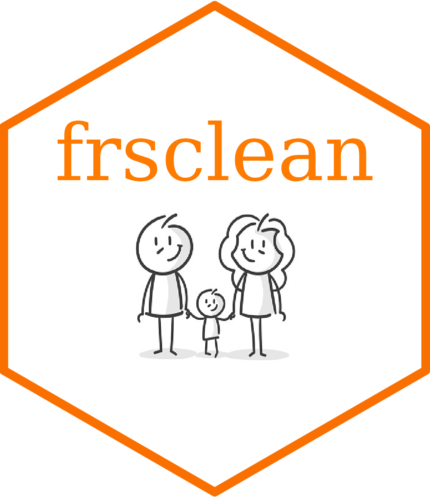

<!-- README.md is generated from README.Rmd. Please edit that file -->

```{r, include = FALSE}
knitr::opts_chunk$set(
  collapse = TRUE,
  comment = "#>",
  fig.path = "man/figures/README-",
  out.width = "100%"
)
```


# Family Resources Survey Data Cleaning 

<!-- badges: start -->
[](https://www.repostatus.org/#wip)
[](https://doi.org/10.17605/OSF.IO/GNSEJ)
<!-- badges: end -->


## Citation

Morris, D. (2023). frsclean: An R package for cleaning the Family Resources Survey data. R package version [x.x.x]. University of Sheffield. doi: https://doi.org/10.17605/OSF.IO/GNSEJ

## Motivation
The motivation for `frsclean` is to develop a set of standard functions for processing raw data from the Family Resources Survey (FRS), which is a survey of households representative of the UK population primarily collecting detailed information on income, taxes, and benefits. 

## Usage

The `frsclean` package contains functions which read in the raw data files, process them into clean output variables, and combines all data files into a single output data table. The functions also create real-terms values for nominally valued monetary variables (earnings and wages), allowing the user to select either the CPIH or RPI.

The **inputs** are the raw FRS data files obtained from the [UK Data Service](https://ukdataservice.ac.uk/). These must be the tab delimited versions of the data, __not Stata or SPSS__, and must be placed together in a single directory. 

A typical workflow for using the package looks as follows, with the read data function for each individual year contained within a 
global cleaning function which applies each cleaning function in turn. The collection of global cleaning functions for each year are 
then wrapped in a function to combine years of data.

```{r workflow, message = FALSE, eval = FALSE}

### Define arguments 

root <- "C:/"
file <- "Documents/Datasets/Family Resources Survey/tab"
ages <- 16:64
years <- 2020
keep_vars <- NULL
complete_vars <- NULL

#########################################
### Read in and combine years of data ###

data <- frsclean(root = root,
                 file = file,
                 ages = ages,
                 years = years,
                 keep_vars = keep_vars,
                 complete_vars = complete_vars)


```

The **output** of these functions are a single data table of processed FRS data

## Installation
`frsclean` is available on GitHub. If you are on a Windows machine you will also need to [install Rtools](https://www.rdocumentation.org/packages/installr/versions/0.22.0/topics/install.Rtools).   
Once that is sorted, you can install the latest version or a specified version from GitHub with:     

```{r gh_installation, message=FALSE, eval = FALSE}
#install.packages("devtools")
#install.packages("getPass")
#install.packages("git2r")

devtools::install_git(
  "https://github.com/djmorris1989/frsclean.git", 
  ref = "x.x.x",
  build_vignettes = TRUE
)

```
