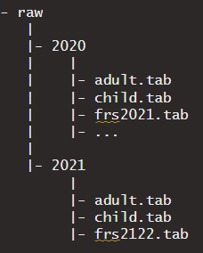

### Storing data for use with the package

The **inputs** are the raw FRS data files obtained from the [UK Data Service](https://ukdataservice.ac.uk/). __These must be the tab delimited versions of the data, not Stata or SPSS__, and all individual tab delimited files needed must be placed together in a single directory for the FRS data. Within that directory, all files for a given year of the data must be put in their own sub-directory named for the calendar year in which the financial year covered by the data started. For example, all data files from the 2021/22 FRS data must be put in a folder named "2021". The schematic below gives an example of the folder structure needed for storing two of the FRS datasets for use in a project with the data stored in a "raw" folder:


        
A typical workflow for using the package looks as follows, with the read data function for each individual year contained within a global cleaning function which applies each cleaning function in turn. The collection of global cleaning functions for each year are then wrapped in a function to combine years of data into a single data table for output. 

### Cleaning the data

The `frsclean()` wrapper function is used to process multiple annual cross-sections of the FRS data

```{r workflow, message = FALSE, eval = FALSE}

library(frsclean)
library(data.table)
library(tidyverse)

root <- "X:/"
file <- "HAR_PR/PR/IPS_beyond_SMI_NIHR202996/General/R/data-family-resources-survey/data/raw"
years <- 2020:2021
ages <- NULL
keep_vars <- NULL
complete_vars <- NULL

### run cleaning function

data <- frsclean(root = root,
                 file = file,
                 years = years,
                 ages = ages,
                 keep_vars = keep_vars,
                 complete_vars = complete_vars)

```
